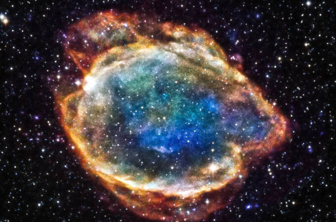

The goal of this project is to detect anomalies in stellar lightcurves, specifically 'dipper' events which are common in young stars. We are modeling the lightcurve with a Gaussian process and assessing the likelihood of points to determine whether they are anomalous. We are developing an autoregressive model of the lightcurves to compare to the performance of the Gaussian process.

Source: <a href="https://github.com/linneawolniewicz/dipper-detection"><i class="large github icon "></i>linneawolniewicz/dipper-detection</a>
