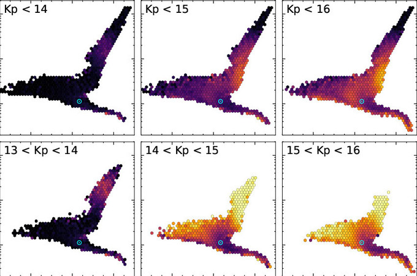

First author paper published after an REU in the Summer of 2020 at the Institute for Astronomy at UH Mānoa. I also presented this work as a scheduled talk at the AAS 237th conference.

Arxiv paper: 

Source: 