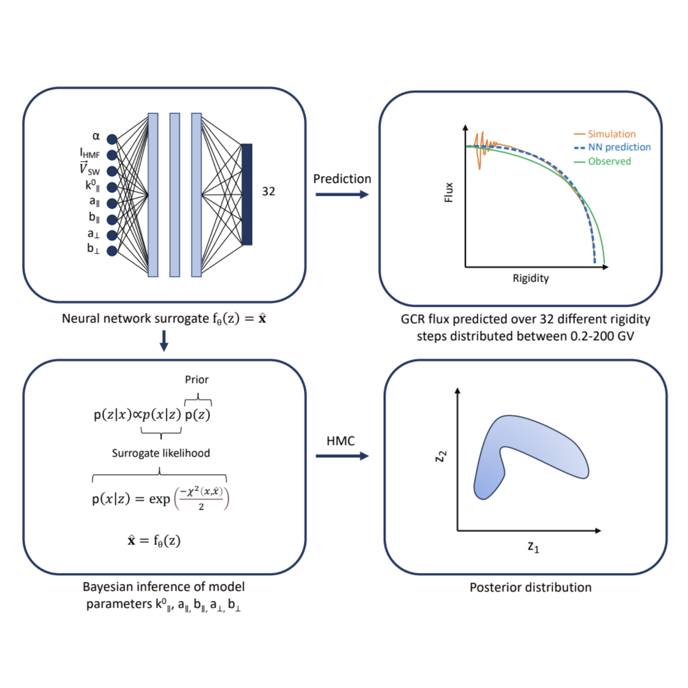

Neural Surrogate HMC: Accelerated Hamiltonian Monte Carlo with a Neural Network Surrogate Likelihood

Masters Project, presented as a scheduled talk at SPAICE 2024 and presented as a poster the 37th NeurIPS Machine Learning for the Physical Sciences Workshop.

Arxiv paper: 

Source: 
