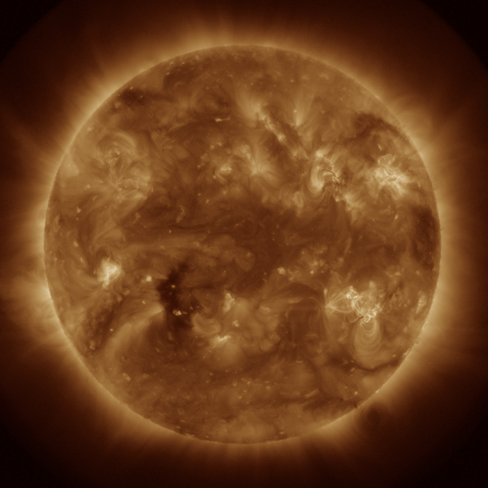

I conducted this work as an undergraduate researcher at the University of Colorado Boulder, working for the Laboratory for Atmospheric and Space Physics (LASP). We presented this work at the NeurIPS 3rd Machine Learning for the Physical Sciences workshop in 2020.

Paper: 
Poster: 

Source: 
